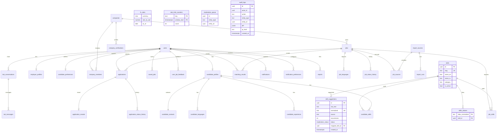

# ERD

Generated from section 4.1 of `docs/TZ_INTGETION_v6.md`. Migration 0001 creates `users`. Migration 0002 creates `audit_logs` and `rate_limit_counters`. Migration 0003 creates `skills`, `skills_aliases`, and `skill_suggestions`. Other entities are the target model and are not tables yet.

