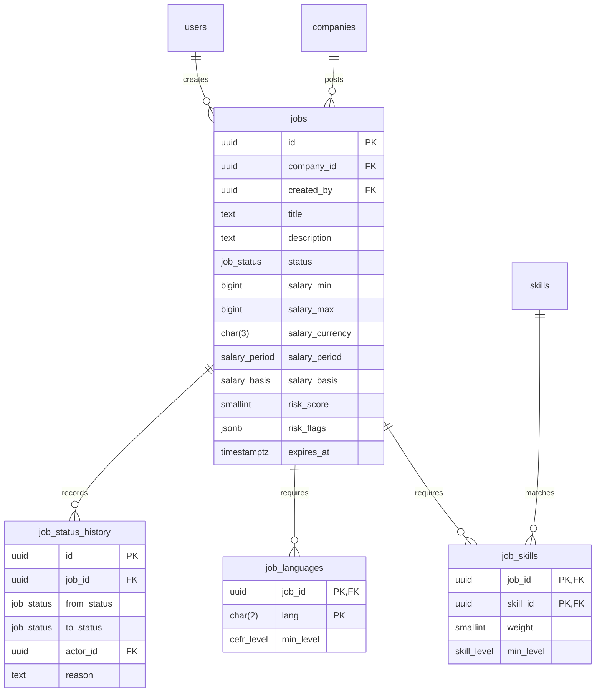
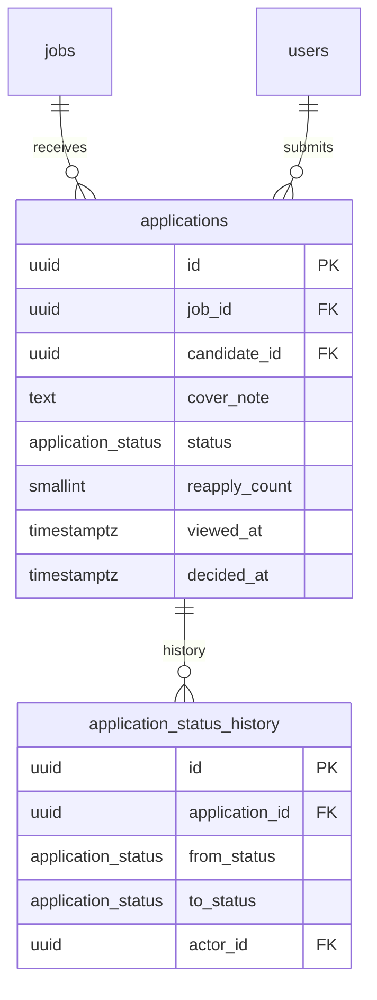

# ERD

Generated from section 4.1 of `docs/TZ_INTGETION_v6.md`. Migrations 0001–0004 create users, infra, skills, and companies. Migration 0005 creates `candidate_profiles`, `candidate_skills`, `candidate_experience`, `candidate_languages`, `candidate_preferences`, and `candidate_contacts`. Migration 0011 creates `saved_jobs`, `user_job_feedback`, and `reports`. Later subphases add the remaining target model.

```mermaid
erDiagram
  users ||--o| candidate_profiles : has
  users ||--o| employer_profiles : has
  users ||--o| candidate_preferences : prefers
  users ||--o{ company_members : member
  users ||--o{ applications : submits
  users ||--o{ saved_jobs : saves
  users ||--o{ user_job_feedback : feedback
  users ||--o{ bot_conversations : chats
  users ||--o{ matching_results : scored
  users ||--o{ notifications : receives
  users ||--o{ notification_preferences : configures
  users ||--o{ reports : files
  companies ||--o{ company_members : employs
  companies ||--o{ company_verifications : verifies
  companies ||--o{ jobs : posts
  jobs ||--o{ job_skills : requires
  jobs ||--o{ job_languages : requires
  jobs ||--o{ job_status_history : history
  jobs ||--o{ job_sources : sourced
  jobs ||--o{ applications : receives
  jobs ||--o{ matching_results : scored
  import_sources ||--o{ job_sources : provides
  import_sources ||--o{ import_runs : runs
  skills ||--o{ job_skills : used
  skills ||--o{ candidate_skills : used
  skills ||--o{ skills_aliases : alias
  skills ||--o{ skill_suggestions : suggested
  candidate_profiles ||--o{ candidate_skills : has
  candidate_profiles ||--o{ candidate_experience : has
  candidate_profiles ||--o{ candidate_languages : has
  candidate_profiles ||--|| candidate_contacts : contacts
  applications ||--o{ application_status_history : history
  applications ||--o| application_reveals : reveal
  bot_conversations ||--o{ bot_messages : messages
  fx_rates {
    char currency
    numeric rate_to_usd
    date as_of
  }
  rate_limit_counters {
    text key PK
    timestamptz window_start PK
    int count
  }
  moderation_queue {
    uuid id
    text entity_type
    uuid entity_id
  }
  companies {
    uuid id PK
    text name
    text slug UK
    text domain
    text website_url
    text description
    text logo_path
    company_status status
    company_origin origin
    uuid created_by FK
    timestamptz created_at
    timestamptz updated_at
  }
  company_members {
    uuid company_id PK, FK
    uuid user_id PK, FK
    member_role role
    timestamptz created_at
  }
  employer_profiles {
    uuid user_id PK, FK
    text full_name
    text title
    text linkedin_url
    timestamptz updated_at
  }
  audit_logs {
    uuid id PK
    uuid actor_id
    text action
    text entity_type
    uuid entity_id
    jsonb diff
    text ip_hash
    timestamptz created_at
  }
  skills {
    uuid id PK
    text slug UK
    text name_en
    text name_ru
    text category
    bool is_active
  }
  skills_aliases {
    text alias_normalized PK
    uuid skill_id FK
  }
  skill_suggestions {
    uuid id PK
    text raw_text
    text normalized UK
    text source
    int occurrences
    moderation_status status
    uuid mapped_skill_id FK
    timestamptz created_at
  }
  candidate_profiles {
    uuid user_id PK
    text full_name
    text headline
    text timezone
    smallint completeness
  }
  candidate_skills {
    uuid candidate_id PK
    uuid skill_id PK
    skill_level level
  }
  candidate_experience {
    uuid id PK
    uuid candidate_id FK
    text company_name
    date start_month
  }
  candidate_languages {
    uuid candidate_id PK
    char lang PK
    cefr_level level
  }
  candidate_preferences {
    uuid user_id PK
    text categories
  }
  candidate_contacts {
    uuid candidate_id PK
    citext email
    text phone
  }
```

Migration 0004 (3A) creates companies, company_members, employer_profiles, and the moderation_queue table used for possible_duplicate records.

Migration 0006 (3B) creates jobs, job_skills, job_languages, and job_status_history. All use deny-all RLS; jobs reference companies and users, job_skills reference taxonomy skills, and job status changes are recorded in job_status_history.

Migration 0009 creates `applications` and `application_status_history`. Migration 0012 creates `application_reveals` (one row per application, `via = shortlisted`). Migration 0013 creates `notifications`, `notification_preferences`, and `notification_emails` (the mail queue, D125). Migration 0015 creates `matching_results` (one row per user and job, D150). One active row per job and candidate (`status <> withdrawn`). A status change is an update of `applications` plus a history row; the first row is an insert with `from_status` null. The reveal row is inserted in the same transaction as the move to `shortlisted`.

