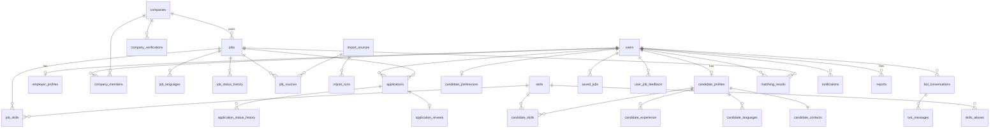

# Модель данных

> Живое ТЗ домена. Монолит v6: [archive/tz/TZ_INTGETION_v6.md](../archive/tz/TZ_INTGETION_v6.md).
> Карта: [tz/INDEX.md](INDEX.md) · сейчас: [CURRENT.md](../CURRENT.md).

> ERD: [../ERD.md](../ERD.md).

## 4. МОДЕЛЬ ДАННЫХ

Соглашения: `id uuid pk default gen_random_uuid()`; все времена `timestamptz`;
`created_at default now()`, `updated_at` — триггер; тексты с лимитами длины
через `check`; enum — Postgres enum-типы; удаление пользователя — soft (D28).

### 4.0 Enum-типы
```
user_status:        active | suspended | deleted
platform_role:      user | admin
work_format:        remote | hybrid | onsite
employment_type:    full_time | part_time | contract
salary_period:      hour | month | year
salary_basis:       gross | net
skill_level:        novice | intermediate | advanced | expert
cefr_level:         A1 | A2 | B1 | B2 | C1 | C2 | native
company_status:     unverified | pending_verification | verified | rejected | suspended
company_origin:     internal | imported
company_size:       s1_10 | s11_50 | s51_200 | s201_1000 | s1000_plus
member_role:        owner | admin | recruiter | member
job_status:         draft | pending_moderation | published | paused | expired | closed | removed
job_source:         internal | imported
application_method: internal | external_url | email
application_status: applied | viewed | shortlisted | interview | offer | hired | rejected | withdrawn
feedback_action:    viewed | saved | unsaved | applied | applied_external | dismissed | hidden | hidden_company
report_reason:      scam | spam | fake_company | discrimination | wrong_info | inappropriate | other
report_status:      open | confirmed | dismissed
moderation_status:  pending | approved | rejected
notification_channel: inapp | email
verification_method:  corporate_email | dns_txt
verification_status:  pending | verified | expired | failed
```

### 4.1 Таблицы

```
-- ============ USERS / AUTH ============
users(
  id uuid pk,
  auth_uid uuid unique not null,              -- auth.users.id (Supabase)
  platform_role platform_role not null default 'user',
  status user_status not null default 'active',
  locale text not null default 'en' check (locale in ('en','ru')),
  terms_accepted_at timestamptz not null,
  terms_version text not null,
  marketing_opt_in bool not null default false,
  last_active_at timestamptz, created_at, updated_at, deleted_at timestamptz)

-- ============ CANDIDATE ============
candidate_profiles(
  user_id uuid pk fk users on delete cascade,
  full_name text check(len<=120),
  headline text check(len<=160),
  desired_titles text[] not null default '{}'   -- ≤5, каждый ≤80
  country char(2),                              -- ISO 3166-1 alpha-2
  city text,
  timezone text not null,                       -- IANA, валидируется Intl
  work_hours_start time not null default '09:00',   -- локальное время кандидата
  work_hours_end   time not null default '18:00',
  work_days smallint[] not null default '{1,2,3,4,5}', -- ISO weekday
  work_formats work_format[] not null default '{remote}',
  employment_types employment_type[] not null default '{full_time}',
  experience_years smallint check(0..60),
  availability_date date,
  salary_min bigint, salary_max bigint,         -- минорные единицы (D19)
  salary_currency char(3), salary_period salary_period, salary_basis salary_basis,
  min_overlap_hours smallint not null default 3 check(0..12),
  summary text check(len<=2000),
  is_hidden bool not null default false,        -- скрыть из рекомендаций/дайджестов работодателям (V3-совместимо)
  completeness smallint not null default 0 check(0..100),
  created_at, updated_at,
  check (salary_min is null or salary_max is null or salary_min <= salary_max),
  check ((salary_min is null and salary_max is null) or
         (salary_currency is not null and salary_period is not null and salary_basis is not null)))

candidate_skills(candidate_id fk candidate_profiles, skill_id fk skills,
  level skill_level not null, years smallint null,
  pk(candidate_id, skill_id))                   -- ≤30 на кандидата (сервис)

candidate_experience(id, candidate_id fk, company_name text, title text,
  start_month date not null, end_month date null,   -- null = по настоящее время
  description text check(len<=2000), sort smallint)

candidate_languages(candidate_id fk, lang char(2) /*ISO 639-1*/, level cefr_level,
  pk(candidate_id, lang))

candidate_preferences(user_id pk fk, categories text[] default '{}',
  company_sizes company_size[] default '{}', notes text check(len<=500))

candidate_contacts(                               -- ОТДЕЛЬНАЯ таблица (D16)
  candidate_id pk fk candidate_profiles on delete cascade,
  email citext not null,                          -- контактный, может отличаться от логина
  phone text null,                                -- E.164
  telegram text null, linkedin_url text null, website_url text null,
  extra jsonb not null default '{}', updated_at)
  -- RLS deny all; доступ только contactsService (ESLint-правило)

-- ============ COMPANIES ============
companies(
  id, name text not null, slug text unique not null,
  domain citext unique null, website_url text,
  linkedin_url text null, telegram_url text null, x_url text null,
  description text check(len<=5000), logo_path text,   -- Storage path
  country char(2), size company_size,
  legal_name text, registration_number text,           -- «реквизиты» для верификации
  status company_status not null default 'unverified',
  origin company_origin not null default 'internal',   -- D9
  is_trusted bool not null default false,              -- вычисляется ночью (14.2)
  trusted_at timestamptz,
  created_by uuid fk users null,                       -- null для imported
  created_at, updated_at)
  idx: (status), gin_trgm(name)

company_members(company_id fk, user_id fk, role member_role not null,
  created_at, pk(company_id, user_id))
  -- MVP: создатель = owner; инвайты — V2. Последнего owner удалить нельзя.
  -- Вступление в company.origin='imported' запрещено (D9).

company_verifications(id, company_id fk, method verification_method,
  target text not null,                 -- email на домене или домен
  token_hash text not null, status verification_status default 'pending',
  expires_at timestamptz not null,      -- 72 ч
  verified_at timestamptz, created_by fk users, created_at)

employer_profiles(user_id pk fk, full_name text, title text, linkedin_url text)

-- ============ JOBS ============
jobs(
  id, company_id fk companies, created_by fk users null,
  title text not null check(len 3..140),
  description text not null check(len 50..20000),   -- Markdown, рендер через sanitize
  category text not null,                           -- = skills.category
  work_format work_format not null default 'remote',
  employment_type employment_type not null,
  experience_min smallint null, experience_max smallint null,
  location text null,                               -- обязателен для hybrid/onsite
  location_country char(2) null,
  country_restrictions char(2)[] null,              -- null = весь мир
  timezone_required text null,                      -- IANA
  work_hours_start time null, work_hours_end time null,  -- в timezone_required
  min_overlap_hours smallint not null default 3 check(0..12),
  salary_min bigint null, salary_max bigint null,
  salary_currency char(3) null, salary_period salary_period null, salary_basis salary_basis null,
  application_method application_method not null,
  application_url text null, application_email citext null,
  source job_source not null default 'internal',
  status job_status not null default 'draft',
  risk_score smallint not null default 0,
  published_at, expires_at,                         -- по умолчанию published_at + 30 дн.
  imported_at timestamptz null,
  fts tsvector generated always as (
    setweight(to_tsvector('simple', coalesce(title,'')), 'A') ||
    setweight(to_tsvector('simple', coalesce(description,'')), 'B')) stored,
  created_at, updated_at,
  check (source='internal' or application_method <> 'internal'),   -- D8
  check (work_format='remote' or location is not null))
  idx: (status, published_at desc), (company_id, status), gin(fts),
       gin_trgm(title), gin(country_restrictions), (status, expires_at)

job_skills(job_id fk, skill_id fk, weight smallint not null check(1..3),
  -- 1 = nice-to-have, 2 = важно, 3 = must-have
  min_level skill_level null, pk(job_id, skill_id))
  idx: (skill_id, job_id)

job_languages(job_id fk, lang char(2), min_level cefr_level, pk(job_id, lang))

job_status_history(id, job_id fk, from_status job_status null, to_status job_status,
  actor_id uuid null /* null = system */, reason text null, created_at)

job_sources(job_id fk, import_source_id fk, external_id text not null,
  source_url text not null, first_seen_at, last_seen_at,
  unique(import_source_id, external_id))           -- агрегирование дублей

-- ============ APPLICATIONS ============
applications(
  id, job_id fk jobs, candidate_id fk users,
  cover_note text check(len<=2000),
  status application_status not null default 'applied',
  reapply_count smallint not null default 0,
  viewed_at, decided_at, created_at, updated_at)
  unique index uq_active_application on (job_id, candidate_id) where status <> 'withdrawn'  -- D27
  idx: (candidate_id, created_at desc), (job_id, status, created_at desc)

application_status_history(id, application_id fk, from_status, to_status,
  actor_id fk users, created_at)

application_reveals(application_id pk fk, revealed_by fk users,
  revealed_at timestamptz not null, via text not null check (via='shortlisted'))
  -- INSERT только внутри транзакции express-interest (D3)

-- ============ FEEDBACK ============
saved_jobs(user_id fk, job_id fk, created_at, pk(user_id, job_id))
user_job_feedback(id, user_id fk, job_id fk, company_id fk null,
  action feedback_action not null, reason text null, created_at)
  idx: (user_id, action, created_at desc), (user_id, job_id)
  -- reason для hidden/dismissed: salary | format | timezone | company | role | other

-- ============ TAXONOMY ============
skills(id, slug text unique, name_en text, name_ru text, category text not null,
  is_active bool default true)
skills_aliases(alias_normalized text unique, skill_id fk)   -- lower, без пунктуации/версий
skill_suggestions(id, raw_text text, normalized text unique, source text /*user|bot|import*/,
  occurrences int default 1, status moderation_status default 'pending',
  mapped_skill_id fk null, created_at)
  -- свободный текст навыка в профиле/вакансии НЕ хранится; только здесь, на очереди

-- ============ MONEY ============
fx_rates(currency char(3), rate_to_usd numeric(18,8) not null, as_of date,
  pk(currency, as_of))                              -- обновляется cron раз в сутки

-- ============ MATCHING ============
matching_results(user_id fk, job_id fk, score numeric(5,4) not null,
  breakdown jsonb not null, explain jsonb not null, algo_version smallint not null,
  computed_at timestamptz not null, pk(user_id, job_id))
  idx: (user_id, score desc)

-- ============ BOT ============
bot_conversations(id, user_id fk null, channel text not null default 'web',
  session_token_hash text unique not null, locale text,
  state jsonb not null default '{}',               -- слоты, черновик профиля, этап
  summary text null,                               -- сжатие старой истории
  linked_at timestamptz null, created_at, last_message_at)
bot_messages(id, conversation_id fk, role text check (role in ('user','assistant','tool','system_event')),
  content text, tool_call jsonb null, tokens_in int default 0, tokens_out int default 0,
  cost_micro_usd bigint default 0, created_at)
  idx: (conversation_id, created_at)

-- ============ NOTIFICATIONS ============
notifications(id, user_id fk, type text not null, payload jsonb not null,
  read_at timestamptz null, created_at)  idx: (user_id, read_at, created_at desc)
notification_preferences(user_id fk, type text, channel notification_channel,
  enabled bool not null, pk(user_id, type, channel))

-- ============ MODERATION / ADMIN ============
reports(id, reporter_id fk users, entity_type text check in ('job','company','user'),
  entity_id uuid, reason report_reason, details text check(len<=1000),
  status report_status default 'open', decided_by fk null, decided_at, created_at)
  unique(reporter_id, entity_type, entity_id)       -- одна жалоба на объект
moderation_queue(id, entity_type text, entity_id uuid, reason text,
  risk_flags jsonb not null default '[]', status moderation_status default 'pending',
  assigned_to fk users null, decided_by fk null, decision_note text, decided_at, created_at)
  idx: (status, created_at)
audit_logs(id, actor_id uuid null, action text, entity_type text, entity_id uuid,
  diff jsonb, ip_hash text null, created_at)  idx: (entity_type, entity_id), (actor_id, created_at)

-- ============ INGESTION ============
import_sources(id, name text unique, kind text check in ('api','rss'), url text,
  enabled bool default false, republish_allowed bool default false,
  config jsonb default '{}', last_run_at, last_status text)
import_runs(id, source_id fk, started_at, finished_at, fetched int, created int,
  updated int, merged int, rejected int, expired int, error text null)

-- ============ INFRA ============
rate_limit_counters(key text, window_start timestamptz, count int not null,
  pk(key, window_start))                            -- D26; чистка cron ежечасно
```

**Намеренно отсутствуют:** переписка (D10), платежи/подписки (V3; схема не
блокирует — `companies` расширяется полем плана позже), векторы (D11), своя
таблица паролей/identities (D7), claim импорта (D9), CV-файлы (V2).
Новые таблицы — только с записью в `docs/DECISIONS.md`.

### 4.2 Статус-машина отклика (единственная, D2)

| Из \ В | viewed | shortlisted | interview | offer | hired | rejected | withdrawn |
|--------|--------|-------------|-----------|-------|-------|----------|-----------|
| applied | E (авто при открытии) | E, только express-interest | — | — | — | E | C |
| viewed | — | E, только express-interest | — | — | — | E | C |
| shortlisted | — | — | E | — | — | E | C |
| interview | — | — | — | E | — | E | C |
| offer | — | — | — | — | E | E | C |
| hired / rejected / withdrawn | терминальные | | | | | | |

E — член компании (owner/admin/recruiter), C — кандидат-владелец.
- Каждый переход: проверка таблицы → UPDATE → INSERT history → событие
  уведомления — одна транзакция. Недопустимый переход → 409 `INVALID_TRANSITION`.
- Переход в `shortlisted` = `express-interest`: `SELECT … FOR UPDATE`, UPDATE
  статуса, INSERT `application_reveals` — одна транзакция (D3). Тест: сбой
  между UPDATE и INSERT → откат обоих.
- UI MVP показывает applied / viewed / shortlisted / rejected / withdrawn и
  кнопки interview/offer/hired в карточке отклика работодателя (статусы в БД и
  API с первого дня).

### 4.3 Прочие машины

**job**

| Переход | Кто | Условие |
|---------|-----|---------|
| draft → pending_moderation | member | publish, компания unverified/pending или risk_score ≥ 4 |
| draft → published | member | publish, компания verified и risk_score < 4 |
| pending_moderation → published / draft(rejected) | admin | решение в очереди (причина обязательна при отказе) |
| published ⇄ paused | member | — |
| published/paused → closed | member | — |
| published → expired | system | cron по `expires_at`; imported — исчезла из источника 2 прогона подряд |
| any → removed | admin | модерация/жалобы; viewable только админу |
| paused/expired → published | member | продление `expires_at` (+30 дн.), повторная проверка risk |

Каждый переход — запись в `job_status_history`. Imported-вакансии меняют
статус только system/admin (D9).

**company:** `unverified → pending_verification → verified | rejected`;
`verified → suspended` (admin); `rejected → pending_verification` (повторная
заявка не чаще 1 раза в 7 дней). `is_trusted` — флаг поверх `verified`.

**user:** `active → suspended` (admin, обратимо) `| deleted` (сам или admin,
необратимо, анонимизация D28).

### 4.4 ERD (ядро; полный — в docs/ERD.md, генерируется из раздела 4.1)


---
